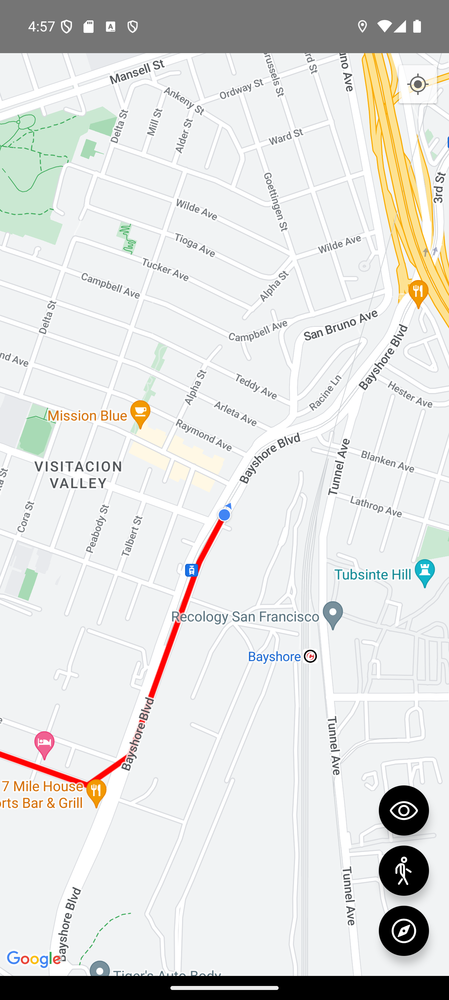

# 📍 React Native Maps & Permisos

Este proyecto fue desarrollado con **React Native CLI** como parte de un curso para aprender sobre permisos en dispositivos móviles y el uso de mapas. Se implementaron permisos de GPS, seguimiento de ubicación, trazado de rutas y colocación de marcadores, utilizando **Zustand** para la gestión de estado.

## 🚀 Características

- Manejo de permisos de GPS en iOS y Android.
- Obtención de ubicación en tiempo real.
- Seguimiento de usuario en el mapa.
- Uso de **Apple Maps** y **Google Maps**.
- Configuración e instalación de mapas en React Native.
- Creación de marcadores y trazado de rutas dinámicas.
- Contexto global para permisos, reutilizable en otras aplicaciones.

## 🛠️ Tecnologías utilizadas

- **React Native CLI**
- **Zustand** (Gestión de estado)
- **React Native Maps** (Google Maps y Apple Maps)
- **React Native Permissions** (Manejo de permisos en dispositivos)

## 📱 Capturas de Pantalla



## 📦 Instalación

1. Clona el repositorio:
   ```sh
   git clone https://github.com/tu-usuario/nombre-del-repo.git
   cd nombre-del-repo
   ```

2. Instala las dependencias:

   ```sh
   npm install
   ```

3. Instala las dependencias nativas:

   ```sh
   npx pod-install
   ```

4. Ejecuta la aplicación en desarrollo:

   - Android:
     ```sh
     npx react-native run-android
     ```

   - iOS:
     ```sh
     npx react-native run-ios
     ```

## 📜 Notas Importantes
- Para iOS, se deben configurar los permisos en el archivo `Info.plist`.
- En Android, es necesario agregar permisos en `AndroidManifest.xml`.
- Google Maps requiere una API Key configurada en el proyecto.

## 📌 Próximos Pasos
- Integrar geocodificación para direcciones.
- Mejorar la UI con animaciones y transiciones.
- Agregar más ejemplos de permisos como cámara y almacenamiento.

## 📝 Créditos
Proyecto desarrollado como parte del curso de React Native de Fernando Herrera en [DevTalles](https://cursos.devtalles.com/courses/react-native)
